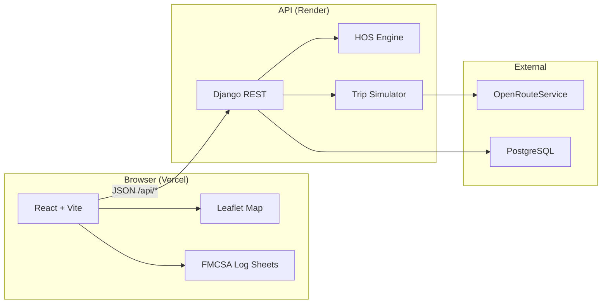
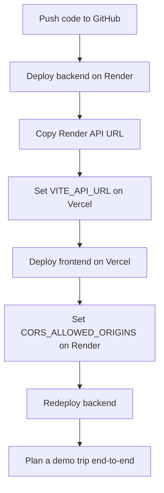

# Spotter — HOS Trip Planner

**Plan truck routes. Stay legal. Print FMCSA log sheets.**

Spotter is a dispatcher-grade trip planner for US freight. Enter four fields — current location, pickup, dropoff, and cycle hours used — and get back a truck-safe route map, stop timeline, and FMCSA §395.8 daily log sheets that respect the 11-hour drive limit, 14-hour window, 30-minute break rule, and 70/8-day cycle.

Built for portfolio demos and real dispatch workflows. Guest mode — no login required.

---

## What you get

| Output | Description |
|--------|-------------|
| **Route map** | HGV routing via OpenRouteService with color-coded stops (pickup, dropoff, fuel, rest, break) |
| **Stop timeline** | Arrival/departure at every planned event along the route |
| **Daily logs** | FMCSA grid with duty-colored segments (Off · Sleeper · Driving · On Duty) |
| **Compliance verdict** | Legal / illegal with reason if HOS clocks are exhausted |

---

## Architecture



**Stack**

- **Frontend:** React 19, Vite, Tailwind v4, Leaflet, Recharts — deployed on **Vercel**
- **Backend:** Django 5 + DRF, pure-Python HOS engine — deployed on **Render**
- **Routing:** OpenRouteService `driving-hgv` profile
- **Database:** PostgreSQL (trip history keyed by guest UUID in `localStorage`)

---

## HOS rules enforced

| Rule | Limit | Reset |
|------|-------|-------|
| Driving window | 14 hours from first on-duty | 10 consecutive hours off |
| Driving limit | 11 hours driving per window | 10 consecutive hours off |
| 30-minute break | After 8 cumulative driving hours | The break itself |
| 70-hour cycle | 70 on-duty hours in 8 days | 34-hour restart |

Trip sequence: pre-trip inspection → drive to pickup → 1 hr on-duty at pickup → drive to dropoff (fuel every ≤1,000 mi) → 1 hr on-duty at dropoff. Rest, break, and restart events are inserted automatically.

---

## Quick start (local)

### Prerequisites

- Python 3.11+
- Node 20+
- Docker (for PostgreSQL)
- [OpenRouteService API key](https://openrouteservice.org/dev/) (free tier)

### 1. Clone and configure

```bash
git clone https://github.com/Najma099/trip.git
cd trip
cp .env.example .env
# Set ORS_API_KEY in .env
```

### 2. Start the database

```bash
docker compose up -d db
```

### 3. Backend

```bash
cd backend
python3 -m venv .venv
source .venv/bin/activate
pip install -r requirements.txt
python manage.py migrate
python manage.py runserver 8000
# → http://127.0.0.1:8000
```

### 4. Frontend

```bash
cd frontend
npm install
npm run dev
# → http://127.0.0.1:5173  (proxies /api to Django)
```

### 5. Try the demo

Open the app → **Try Demo Trip** or on Plan Trip click **Fill demo trip**:

- Current: Dallas, TX → Pickup: Houston, TX → Dropoff: Chicago, IL · 20h cycle used

---

## Deployment

Your latest commits live on your machine until you push. GitHub currently shows older commits — run `git push origin main` after pulling this branch.

### Step 0 — Push to GitHub

```bash
git push origin main
```

If you rewrote history (e.g. removed co-author lines), use:

```bash
git push --force-with-lease origin main
```

---

### Backend → Render

1. Go to [render.com](https://render.com) → **New** → **Blueprint** (or Web Service)
2. Connect the `Najma099/trip` GitHub repo
3. Render reads `render.yaml` at the repo root — it creates:
   - **spotter-trip-api** (Python web service, root dir `backend`)
   - **spotter-trip-db** (PostgreSQL)
4. Set environment variables in the Render dashboard:

   | Variable | Value |
   |----------|-------|
   | `ORS_API_KEY` | Your OpenRouteService key |
   | `CORS_ALLOWED_ORIGINS` | Your Vercel URL, e.g. `https://trip-xyz.vercel.app` |
   | `DJANGO_SECRET_KEY` | Auto-generated by Render |
   | `DATABASE_URL` | Auto-linked from PostgreSQL |

5. Deploy. Note your API URL, e.g. `https://spotter-trip-api.onrender.com`

**Manual alternative** (without Blueprint):

- Root directory: `backend`
- Build: `pip install -r requirements.txt && python manage.py migrate --noinput`
- Start: `gunicorn config.wsgi:application --bind 0.0.0.0:$PORT`

---

### Frontend → Vercel

1. Go to [vercel.com](https://vercel.com) → **Add New Project**
2. Import `Najma099/trip` from GitHub
3. Configure:

   | Setting | Value |
   |---------|-------|
   | **Root Directory** | `frontend` |
   | **Framework** | Vite |
   | **Build Command** | `npm run build` |
   | **Output Directory** | `dist` |

4. Add environment variable:

   | Variable | Value |
   |----------|-------|
   | `VITE_API_URL` | `https://spotter-trip-api.onrender.com` (your Render URL, no trailing slash) |

5. Deploy. Vercel uses `frontend/vercel.json` for SPA rewrites.

6. **Update Render CORS:** Go back to Render → set `CORS_ALLOWED_ORIGINS` to your final Vercel URL → redeploy backend.

---

### Deployment checklist



- [ ] GitHub repo is up to date (`git push`)
- [ ] Render web service is live (`/api/geocode/?text=tx` returns JSON)
- [ ] PostgreSQL connected (`DATABASE_URL` set)
- [ ] `ORS_API_KEY` set on Render
- [ ] Vercel deployed with `VITE_API_URL` pointing to Render
- [ ] `CORS_ALLOWED_ORIGINS` on Render includes Vercel domain
- [ ] Demo trip plans successfully from production URL

---

## API reference

### `POST /api/trips/`

```json
{
  "current_location": "Dallas, TX",
  "pickup_location": "Houston, TX",
  "dropoff_location": "Chicago, IL",
  "current_cycle_used": 20.0,
  "guest_id": "uuid-from-localStorage"
}
```

Returns trip with `route.geometry`, `stops[]`, `daily_logs[]`, `is_legal`.

### `GET /api/trips/<id>/`

Retrieve a saved trip (read-only, no re-routing).

### `GET /api/trips/?guest_id=<uuid>`

List guest trip history.

### `GET /api/geocode/?text=<query>`

Location autocomplete suggestions.

---

## Tests

```bash
cd backend
source .venv/bin/activate
DATABASE_URL="" pytest tests/ -v
```

CI runs automatically on push/PR to `main` via `.github/workflows/ci.yml`.

---

## Project structure

```
trip/
├── backend/
│   ├── config/              Django settings & URLs
│   ├── trips/
│   │   ├── models.py        Trip, RouteStop, DutyStatusSegment
│   │   ├── hos_constants.py
│   │   └── services/
│   │       ├── hos_engine.py
│   │       ├── routing.py
│   │       ├── trip_simulator.py
│   │       └── log_builder.py
│   └── tests/
├── frontend/
│   └── src/
│       ├── pages/           Landing, PlanTrip, TripResults, NotFound
│       ├── components/      TripMap, FMCSALogSheet, DaySelector, …
│       └── context/         GuestContext, ToastContext
├── docker-compose.yml
├── render.yaml
└── .github/workflows/ci.yml
```

---

## Intentionally deferred

- JWT auth / account login (guest mode only for MVP)
- Sleeper-berth split (§395.1(g))
- Adverse driving conditions (§395.1(b))
- Team drivers
- Certified ELD device output

---

## License

MIT — for dispatch planning only, not a certified ELD device.
