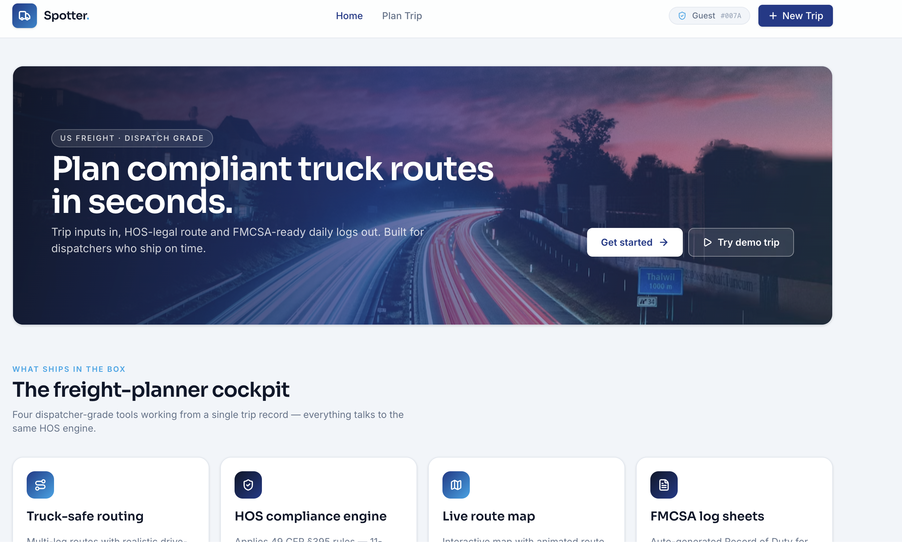
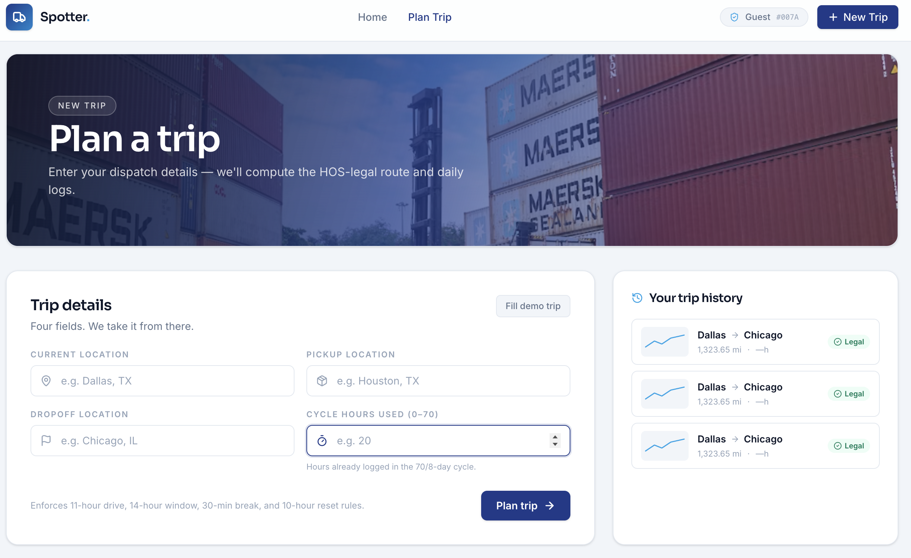
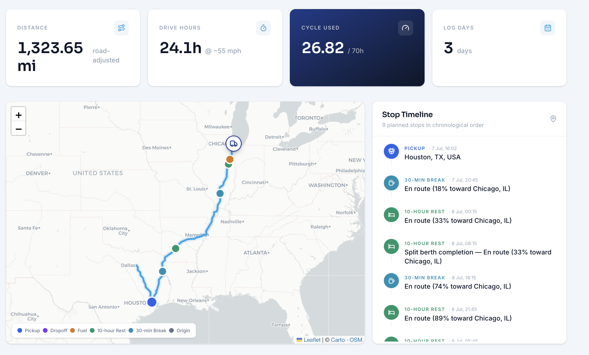

# Spotter: HOS Trip Planner

[](https://github.com/Najma099/trip/actions/workflows/ci.yml)


**Ship it. Log it. Stay legal.**

Spotter is a trip planner for US freight dispatchers. Enter four things: where you are, where the freight is, where it's going, and how many cycle hours you've used. Get back a truck safe route, a stop by stop timeline, and FMCSA daily log sheets that follow the real driving rules.

No login needed. We built full auth too (JWT and all), but when you're dispatching a load at 2 AM, a sign up form is the last thing you need.


**Live demo:** https://trip-six-nu.vercel.app/

**Backend API:** https://trip-y8h3.onrender.com

---

## Screenshots


*Landing page*


*Trip planning form with demo fill*


*Route map, stop timeline, and daily log sheets*


---

## Why guest mode

Dispatch doesn't happen on a 9 to 5 schedule. You should be able to open the page, plan a trip, and hand the driver a log sheet without making an account.

Auth exists (register, login, password reset, token refresh) for when you do want your trips saved. It's optional. Guest mode makes a local ID in your browser and works just as well. No account? Fine. Want one? Also fine.

---

## What's inside

* **Route map**: truck routing with color coded stops. The truck icon animates along the route.
* **Stop timeline**: every stop (pickup, dropoff, fuel, rest, break) with arrival and departure times.
* **Daily logs**: FMCSA grid format with color coded duty status. Print it and hand it to the driver.
* **Compliance verdict**: tells you if the trip is legal, and explains why if it's not.

---

## HOS rules enforced

| Rule | Limit | Reset |
|------|-------|-------|
| Driving window | 14 hours from first on duty | 10 hours off |
| Driving limit | 11 hours driving per window | 10 hours off |
| 30 minute break | After 8 hours of driving | The break itself |
| 70 hour cycle | 70 on duty hours in 8 days | 34 hour restart |
| Split berth | 7+3 or 8+2 sleeper splits | A pair of sleeper periods |

Covers property carrying drivers on the 70 hour/8 day cycle. No adverse conditions exemption yet. If you need short haul or passenger carrying rules, this isn't that, but the engine can be extended.

---

## Key decisions

* **Explicit resets**: most planners guess a reset happened if there's a big time gap. That's unreliable. Spotter inserts reset events directly during simulation, so resets are exact, not guessed.

* **Split berth support**: required by law, and most planners skip it. Spotter handles 7/3 and 8/2 sleeper splits.

* **Road distance fuel stops**: fuel stops used to be placed by straight line distance. Roads don't go in straight lines, so stops landed in the wrong spot. Now stops are placed using actual road distance.

* **JWT auth plus guest mode**: both exist, neither blocks the other. Adding auth didn't break guest trips.

* **Partial TypeScript**: we only converted the hardest parts (the map component, constants, and shared types). Converting everything would take a week for no real benefit.

* **One job per file**: the engine, simulator, router, and log builder each live in their own file. Change one thing, edit one file.

* **Docker**: one command runs the whole thing. No manual setup.

* **Map animation fix**: the route animation used to break because React state fought with the map library. Fixed with a ref and a single animation frame call.

* **30 minute break rule**: only driving time counts toward the 8 hour break trigger. On duty time that isn't driving does not reset that clock. This matches the real regulation.

* **Fuel every 1000 miles**: required by spec. Stops are placed at the correct road distance point.

---

## Quick start (Docker)

```bash
docker compose up --build
# frontend: http://localhost:3000
# backend: http://localhost:8000
```

---

## Quick start (local)

**You'll need:** Python 3.11+, Node 20+, Docker (for the database), and a free OpenRouteService API key.

**1. Start the database**

```bash
docker compose up -d db
```

**2. Backend**

```bash
cd backend
python3 -m venv .venv
source .venv/bin/activate
pip install -r requirements.txt
python manage.py migrate
python manage.py runserver 8000
```

**3. Frontend**

```bash
cd frontend
npm install
npm run dev
```

---

## API example

```bash
curl -X POST http://localhost:8000/api/trips/ \
  -H "Content-Type: application/json" \
  -d '{
    "current_location": "Dallas, TX",
    "pickup_location": "Houston, TX",
    "dropoff_location": "Chicago, IL",
    "current_cycle_used": 20.0,
    "guest_id": "demo-guest"
  }'
```

Response includes `trip_id`, `route` (distance, geometry), `stops`, `daily_logs`, `is_legal`, and `not_legal_reason` if applicable.

---

## Running tests

```bash
cd backend && python -m pytest tests/ -v
cd frontend && npm run test
```

25 backend tests. 8 frontend tests.

---

## Project structure

```
spotter/
  backend/
    accounts/       JWT auth (register, login, me, password reset)
    config/         Django settings, URLs, WSGI
    trips/
      services/
        hos_engine.py       core FMCSA compliance engine
        trip_simulator.py   trip simulation and stop planning
        routing.py          route client and road interpolation
        log_builder.py      daily log sheet generation
        trip_builder.py     saves trips to the database
      models.py, views.py, serializers.py, urls.py
      migrations/
    tests/
    Dockerfile
    requirements.txt
  frontend/
    src/
      components/   React components
      pages/        Landing, PlanTrip, TripResults, auth pages
      context/      Auth, Guest, Toast providers
      services/     API client
      hooks/        useReducedMotion, useDocumentTitle
      utils/        format and validation helpers
      types/        TypeScript type definitions
      constants/     stopColors
    Dockerfile.frontend
    nginx.conf
  docker-compose.yml
  .github/workflows/ci.yml
```

---

## Tech stack

* **Frontend**: React 19, Vite, Tailwind v4, Leaflet, Recharts
* **Backend**: Django 5 + DRF, pure Python HOS engine
* **Routing**: OpenRouteService (truck profile)
* **Database**: PostgreSQL
* **Auth**: JWT via djangorestframework simplejwt
* **Container**: Docker + docker compose

---

## Known limitations

* No team driver support (single driver only)
* No adverse driving conditions exemption
* Fuel and rest stop coordinates are approximate, not tied to real truck stop locations
* Property carrying rules only, no passenger carrying ruleset


---

## Contributing

Issues and pull requests are welcome. Please run the test suite before submitting a PR.

---

## License

MIT. Built for dispatch planning, not a certified ELD device.